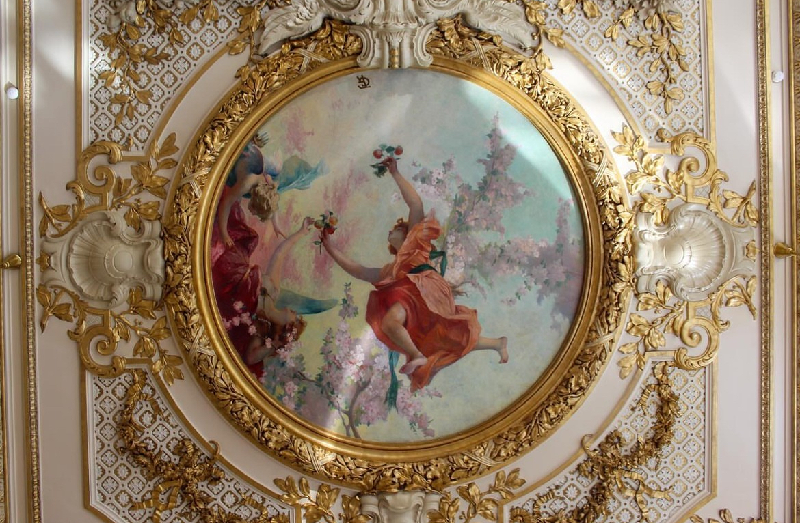

# Ollama Cog Model - llama3.2-vision:90b"

This is an implementation of the Ollama model [llama3.2-vision:90b"](https://ollama.com/library/llama3.2-vision:90b) as a [Cog](https://github.com/replicate/cog) model.

## Development

Follow the [model pushing guide](https://replicate.com/docs/guides/push-a-model) to push your own model to [Replicate](https://replicate.com).
    
## Basic Usage

To run a prediction:

    cog predict -i image=@rococo.jpg -i prompt="Which era does this piece belong to? Give details about the era."

## Input

## Output

   The image features a ceiling painting or mural, which is characteristic of the Rococo style. This art movement emerged in Europe during the 18th century, roughly between 1720 and 1770.